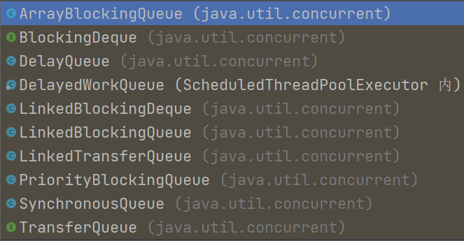
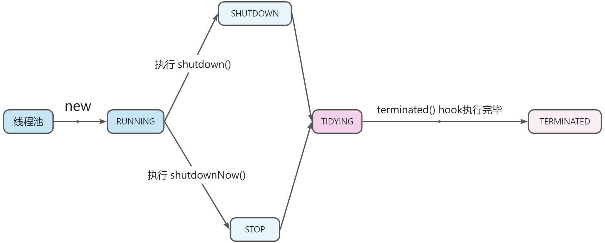
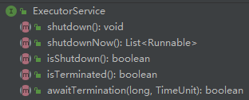
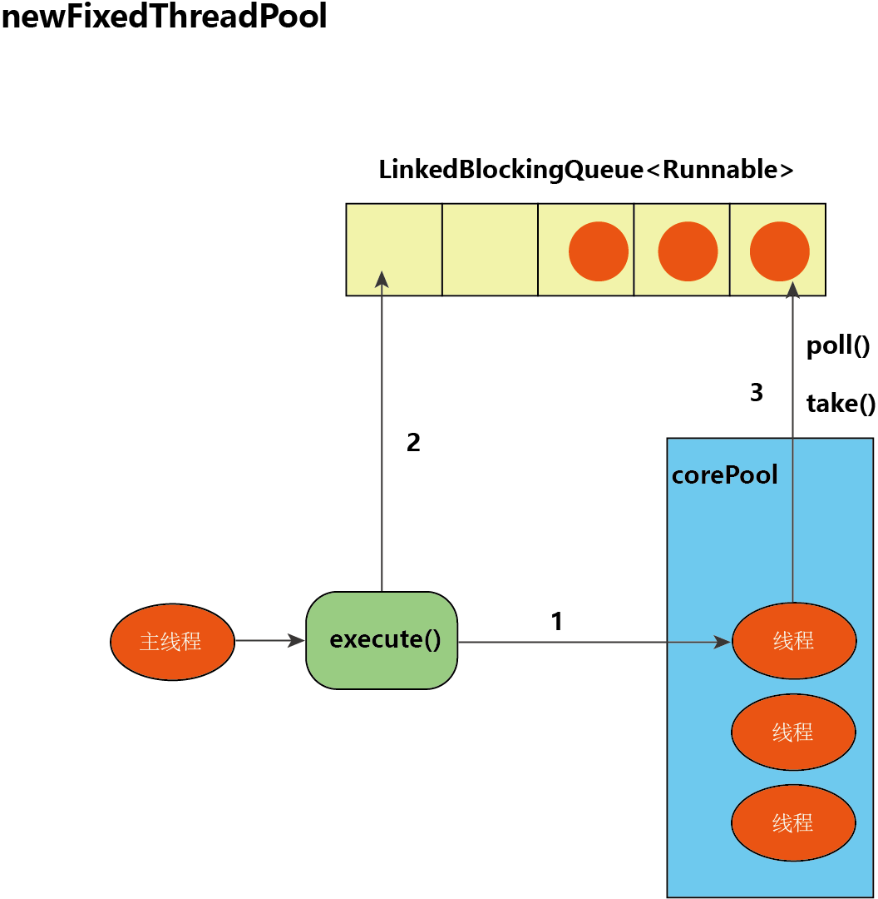
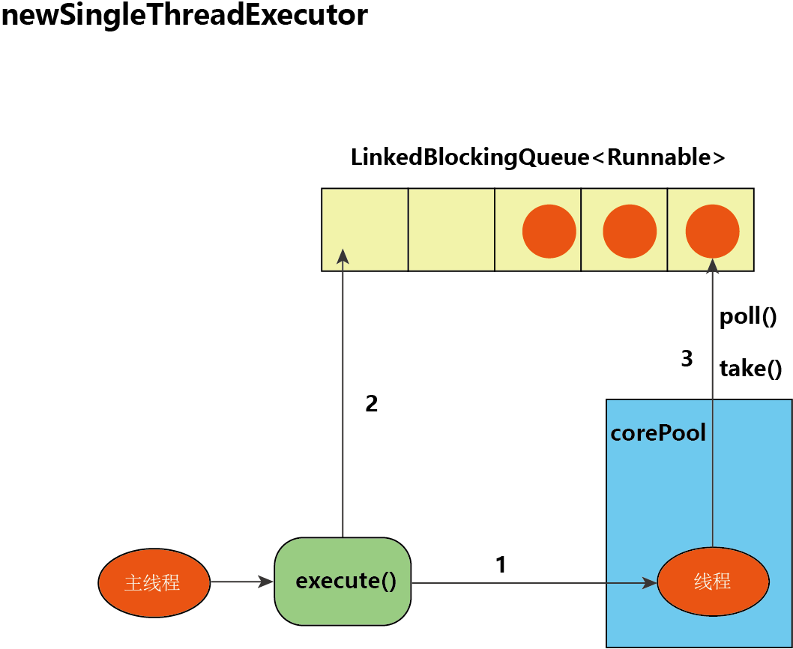
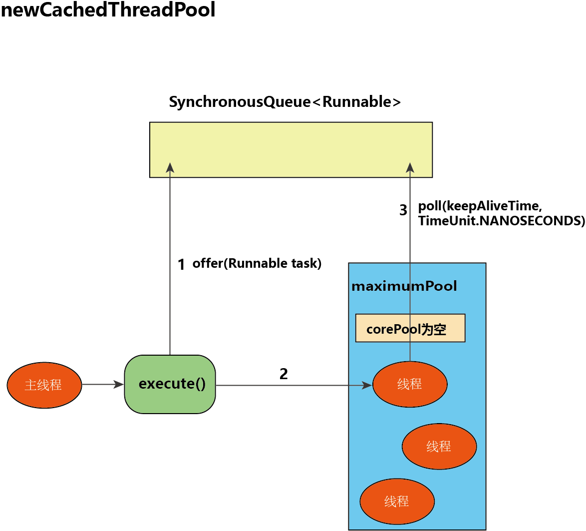
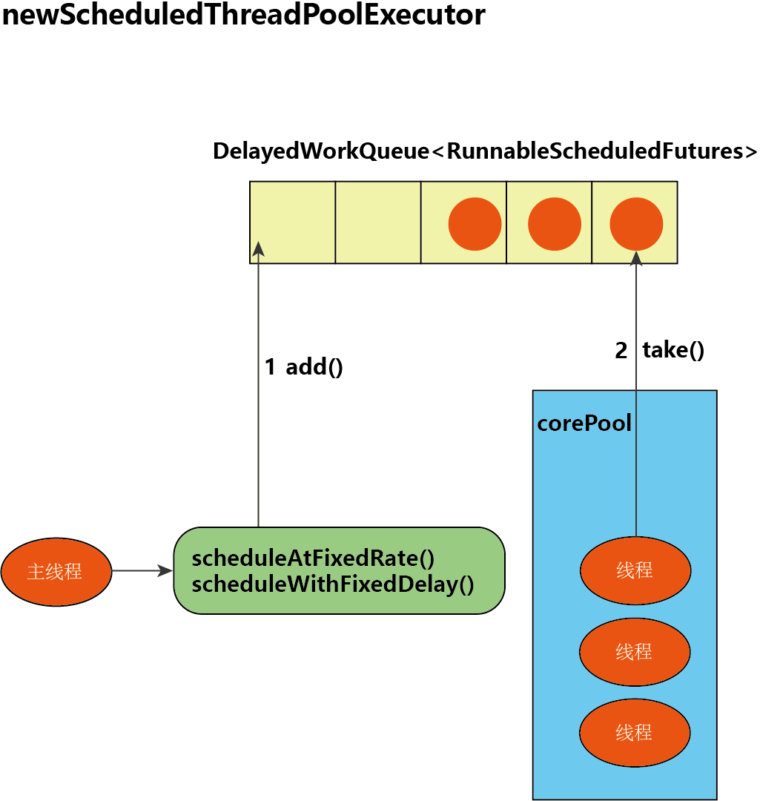

[线程池 · 语雀 (yuque.com)](https://www.yuque.com/haofeiyu/java/exri37)

# 为什么要用线程池

在 HotSpot VM 的线程模型中，Java 线程被一对一映射为内核线程。

Java 在使用线程执行程序时，需要调用操作系统内核的 API，创建一个内核线程，操作系统要为线程分配一系列的资源；当该 Java 线程被终止时，这个内核线程也会被回收。因此 Java 线程的创建与销毁的成本很高，从而增加系统的性能开销。

除此之外，无限制地创建线同样会给系统带来性能问题。因为 CPU 核数是有限的，大量的线程上下文切换会增加系统的性能开销。同时无限制地创建线程还可能导致 OOM。

------

为了解决上述两类问题，于是引入了线程池概念。

对于第一类问题，频繁创建与销毁线程：线程池复用线程，提高线程利用率，避免频繁的创建与销毁线程。

对于第二类问题，大量创建线程：线程池限制线程创建的最大数量，防止无限制地创建线程。

线程池提供了一种方式来管理线程和消费，维护基本数据统计等工作，比如统计已完成的任务数；

# 介绍线程池框架 Executor

Java 提供了一套线程池框架 Executor。

这个框架包括了 [ThreadPoolExecutor](https://docs.oracle.com/javase/9/docs/api/java/util/concurrent/ThreadPoolExecutor.html) 和 [ScheduledThreadPoolExecutor](https://docs.oracle.com/javase/9/docs/api/java/util/concurrent/ScheduledThreadPoolExecutor.html) 两个核心线程池。

- ThreadPoolExecutor 是用来执行被提交的任务
- ScheduledThreadPoolExecutor 是用来执行定时任务。

还有一个 [ForkJoinPool](https://docs.oracle.com/javase/9/docs/api/java/util/concurrent/ForkJoinPool.html) 则是为 ForkJoinTask 定制的线程池，与通常意义的线程池有所不同。

除此之外，[Executors](https://docs.oracle.com/javase/9/docs/api/java/util/concurrent/Executors.html) 类为我们提供了各种方便的静态工厂方法来简化线程池的创建。

```java
public class ScheduledThreadPoolExecutor
        extends ThreadPoolExecutor
        implements ScheduledExecutorService { }
```

从类的定义我们可以看到，ScheduledThreadPoolExecutor 类继承自 ThreadPoolExecutor 类，因此下面我们就重点看看 ThreadPoolExecutor 类是如何实现线程池的。

# ThreadPoolExecutor 的「构造参数」和「工作行为」

ThreadPoolExecutor 的构造函数非常复杂，最完备的构造函数有 7 个参数，如下面代码所示。

```java
public ThreadPoolExecutor(int corePoolSize,
                              int maximumPoolSize,
                              long keepAliveTime,
                              TimeUnit unit,
                              BlockingQueue<Runnable> workQueue,
                              ThreadFactory threadFactory,
                              RejectedExecutionHandler handler)
```

下面我们一一介绍这些参数的意义。（参考了 ThreadPoolExecutor 的 [javadoc](https://docs.oracle.com/javase/9/docs/api/java/util/concurrent/ThreadPoolExecutor.html) ）

## 线程数

corePoolSize：核心线程数

maximumPoolSize：最大线程数


线程池会根据 corePoolSize 和 maximumPoolSize 这两个参数的值，自动调整线程池大小。

当我们向线程池中提交任务时：

- 如果当前有少于 corePoolSize 个线程正在运行，那么将创建一个新的线程来处理请求，即使其他工作线程处于空闲状态（也就是说，前面说的正在运行的线程是指，所有已经创建的线程，包括处于空闲状态的线程）
- 如果当前有大于等于 corePoolSize 个线程正在运行，则尝试把任务加到任务队列中

- - 如果任务队列未满，则加入成功，排队等待线程处理
  - 如果任务队列已满，并且当前有不超过 maximumPoolSize 个线程，则创建一个新的线程来处理请求

- 如果当前有 maximumPoolSize 个线程正在运行，并且任务队列已满，那么线程池会拒绝接收任务，并按照指定的拒绝策略处理任务


通过将 corePoolSize 和 maximumPoolSize 设置为相同的值，我们可以创建固定大小的线程池。

通过将 maximumPoolSize 设置为一个本质上无界的值，例如 Integer.MAX VALUE，允许线程池容纳任意数量的线程。

通常，corePoolSize 和 maximumPoolSize 这两个参数的值只在构造 ThreadPoolExecutor 时设置，但这两个参数的值也可以使用 setCorePoolSize(int) 和 setMaximumPoolSize(int) 动态修改。通过动态修改参数的值，我们可以做到动态配置自定义线程池，感兴趣的可以了解一下，[这个视频](https://time.geekbang.org/dailylesson/detail/100056934)里有讲。

在创建完线程池之后，默认情况下，线程池中没有任何线程，只有在新任务到达时线程才会被创建（new）和执行（start），但这可以通过使用 prestartCoreThread() 或 prestartAllCoreThreads() 方法来动态覆盖。如果使用非空队列构造线程池，则可能需要预启动线程。预启动线程在抢购系统中也经常被用到。

## 非核心线程的存活时间

keepAliveTime：线程存活的实现

TimeUnit：存活时间的单位（小时、分钟、秒、毫秒）


如果线程池当前有超过 corePoolSize 个线程，并且线程空闲的时间超过了 keepAliveTime，那么这些线程将被销毁，这样可以避免线程没有被使用时的资源浪费。

这个参数也可以使用方法 setKeepAliveTime(long，TimeUnit) 动态修改。

默认情况下，只有存在多于 corePoolSize 个线程时，才会应用 keep-alive 策略；但通过 allowCoreThreadTimeOut(boolean) 方法，将参数 allowCoreThreadTimeOut 的值设置为 true，则 keep-alive 策略也可应用于不超过 corePoolSize 个线程时。

## 任务队列

BlockingQueue<Runnable>：任务队列，用来储存等待被执行的任务

如果线程池当前有大于等于 corePoolSize 个线程正在运行，则尝试把任务加到任务队列中

- 如果任务队列未满，则加入成功，排队等待线程处理
- 如果任务队列已满，并且当前有不超过 maximumPoolSize 个线程，则创建一个新的线程来处理请求

也就是说，当线程数量达到 corePoolSize 个之后，不会立即扩容线程池，而是先把任务堆积到任务队列中，任务队列满了之后，才考虑扩容线程池，一直到线程个数达到 maximumPoolSize 为止。

------

这个任务队列必须必须是 [BlockingQueue](https://docs.oracle.com/javase/9/docs/api/java/util/concurrent/BlockingQueue.html) 类型的，也就是必须是阻塞队列。

阻塞队列其实就是在队列基础上支持了阻塞操作。

简单来说，阻塞操作就是：

- 如果队列为空，那么从队头取数据的操作会被阻塞，直到队列中有数据才能返回；
- 如果队列已满，那么从队尾插入数据的操作会被阻塞，直到队列中有空闲位置并插入数据后，才能返回。

Java 中 BlockingQueue 类型的队列也有很多，比如：（共 8 个）

- ArrayBlockingQueue：基于数组结构的有界阻塞队列
- LinkedBlockingQueue：基于链表结构的阻塞队列。可以在创建队列时指定容量；如果没有指定容量，那么其容量限制就自动被设置为 Integer.MAX_VALUE，成为了无界队列。
- SynchronousQueue：不存储元素的阻塞队列。每个移除操作必须等待另一个线程的插入操作，反之每个插入操作也都要等待另一个线程的移除操作。这个队列的容量是 0。
- PriorityBlockingQueue：具有优先级的无界阻塞队列
- DelayQueue：支持延时获取的无界阻塞队列，内部用 PriorityQueue 实现
- LinkedTransferQueue：基于链表结构的无界阻塞队列
- LinkedBlockingDeque：基于双向链表的阻塞队列，可以在创建队列时指定容量
- DelayedWorkQueue：无界阻塞队列

总结来说，BlockingQueue 类型的队列可以从以下两个维度划分：

- 底层结构：数组 or 单向链表 or 双向链表 or 优先级队列（DelayQueue 基于 PriorityQueue）
- 是否有界：有界 or 无界 or 既可以有界又可以无界

理论上两个维度中两两组合，就可以构成一种类型的 BlockingQueue。



## 线程工厂

ThreadFactory：线程工厂，用来创建线程

新线程是使用 ThreadFactory 创建的。

如果没有指定，则 ThreadPoolExecutor 的构造方法默认使用 Executors.defaultThreadFactory()，它将创建线程，使其全部位于同一个线程组中（ThreadGroup），并具有相同的优先级（默认都为 NORM_PRIORITY ）和非守护线程状态。

通过提供不同的 ThreadFactory，我们可以更改线程的名称、线程组、优先级、是否设置为守护线程等。

如果 ThreadFactory#newThread() 方法创建线程失败返回 null ，程序将继续执行，但可能无法执行任何任务。

线程应该拥有“modifyThread”运行时权限。如果工作线程或线程池的其他线程不具备此权限，则服务可能降级：配置更改可能无法及时生效，并且关闭线程池可能处于可以终止但尚未完成的状态。

```java
// ThreadPoolExecutor 类的成员变量
private static final RuntimePermission shutdownPerm =
        new RuntimePermission("modifyThread");

// 检查线程是否拥有 modifyThread 运行时权限
// 该方法在 shutdown()、shutdownNow() 中被调用 
private void checkShutdownAccess() {
    SecurityManager security = System.getSecurityManager();
    if (security != null) {
        security.checkPermission(shutdownPerm);
        final ReentrantLock mainLock = this.mainLock;
        mainLock.lock();
        try {
            for (ThreadPoolExecutor.Worker w : workers)
                security.checkAccess(w.thread);
        } finally {
            mainLock.unlock();
        }
    }
}
```

------

线程组

线程组的 javadoc：https://docs.oracle.com/javase/9/docs/api/java/lang/ThreadGroup.html

线程组表示一组线程，除此之外，线程组还可以包括其他线程组。

线程组形成一个树，其中除初始线程组之外的每个线程组都有一个父线程组。

允许线程访问有关其自己的线程组的信息，但不能访问有关其线程组的父线程组或任何其他线程组的信息。


线程组的作用：

- 用线程组来批量管理、控制一组线程，比如：销毁线程组及其所有子组
- 有效地对线程或线程组对象进行组织。


每个线程（Thread）必然存在于⼀个线程组（ThreadGroup）中，线程不能独立于线程组存在。

如果 new Thread 时没有显式指定所在的线程组，那么默认将父线程 （执行当前 new Thread 的线程）所在的线程组设置为自己所在的线程组。

JVM 创建的 system 线程组是线程组树结构的跟线程组。

system 线程组是用来处理 JVM 的系统任务的线程组，例如对象的销毁等。

system 线程组的直接子线程组是 main 线程组，这个线程组至少包含一个 main 线程，用于执行 main 方法。

main 线程组的子线程组就是应用程序创建的线程组。

## 拒绝策略

RejectedExecutionHandler：拒绝策略

如果我们把任务提交到线程池时，被线程池拒绝接收了，线程池会按照指定的拒绝策略处理任务。

线程池拒绝接收我们提交的任务的原因（时机）可能有以下两个：

- 线程池中的等待被执行的任务过多，任务队列已满，并且线程数达到 maximumPoolSize
- 线程池已经处于非 RUNNING 状态

------

Java 线程池框架提供了以下 4 种拒绝策略：

- AbortPolicy：直接抛出 RejectedExecutionException 异常
- CallerRunsPolicy：用调用者所在线程（提交任务的线程）来执行任务
- DiscardOldestPolicy：丢弃任务队列里最早的任务，把提交的任务加入任务队列
- DiscardPolicy：直接丢弃提交的任务。

------

除了使用以上 Java 线程池框架提供的拒绝策略之外，我们还可以自定义拒绝策略。

实现自定义拒绝策略的步骤：

1. 定义一个拒绝策略类（xxxPolicy），实现 RejectedExecutionHandler 接口
2. 实现接口里的唯一方法 `void rejectedExecution(Runnable r, ThreadPoolExecutor executor)`

在实际工作中，自定义的拒绝策略往往和降级策略配合使用。例如将任务信息插入数据库或者消息引擎系统（Kafka、RocketMQ、...）等存储系统，启用一个专门用作补偿的线程池进行补偿。

所谓降级就是在服务无法正常提供功能的情况下，采取的补救措施。

具体采用何种降级手段，这要看具体场景。

# 线程池的生命周期

对于有生命周期的事物，要学好它，只要能搞懂生命周期中各个节点的状态转换机制就可以了。

## 线程池的运行状态

```java
// Integer.SIZE = 32
private static final int COUNT_BITS = Integer.SIZE - 3;

// runState 存储在数字的高阶位中
// runState is stored in the high-order bits
private static final int RUNNING    = -1 << COUNT_BITS;
private static final int SHUTDOWN   =  0 << COUNT_BITS;
private static final int STOP       =  1 << COUNT_BITS;
private static final int TIDYING    =  2 << COUNT_BITS;
private static final int TERMINATED =  3 << COUNT_BITS;
```

进入 RUNNING 状态后：可以接收新的任务，可以处理任务队列中的任务。

进入 SHUTDOWN 状态后：不接收新的任务，但是可以处理任务队列中的任务。（平缓的关闭过程）

进入 STOP 状态后：不接收新的任务，并且不处理任务队列中的任务（队列中的任务，以集合的形式返回），同时中断所有正在执行的任务。（立即关闭）

进入 TIDYING 状态时：线程池中的工作线程数为 0，任务队列为空，代表所有的任务都已经处理完成。

TERMINATED：进入 TIDYING 状态后，会执行 terminated() hook方法，当执行完该方法后，线程池进入 TERMINATED 运行状态；并唤醒等待线程池终止的线程，所有调用 awaitTermination() 的线程继续向下执行。

terminated() 默认是空方法，需要我们继承 ThreadPoolExecutor 类，自行重写，自定义线程池终止前的处理逻辑。

TIDYING 和 TERMINATED 的行为体现在 ThreadPoolExecutor#tryTerminate() 方法中，感兴趣自行查看

在 shutdown()、shutdownNow() 方法的最后都有调用 tryTerminate() 方法。

## 线程池的状态转换

RUNNING：创建线程池后，线程池进入 RUNNING 运行状态。

SHUTDOWN：执行 shutdown() 方法后，线程池进入 SHUTDOWN 运行状态。

STOP：执行 shutdownNow() 方法后，线程池进入 STOP 运行状态。

TIDYING：当工作线程数为 0，任务队列为空，线程池进入 TIDYING 运行状态。

TERMINATED：当 执行完 terminated() 方法后，线程池进入 TERMINATED运行状态。



## 线程池的 API

下面我们看看，和线程池的运行状态相关的 API



shutdown()：不接收新的任务，但是可以处理任务队列中的任务。（平缓的关闭过程）

shutdownNow()：不接收新的任务，并且不处理任务队列中的任务（返回等待被执行的任务的列表），同时中断所有正在执行的任务。（立即关闭）

isShutdown()：如果线程池的状态为 RUNNING，则返回 false，否则返回 true（描述的是非 RUNNING 状态）

isTerminated()：如果线程池的状态为 TERMINATED，则返回 true，否则返回 false

awaitTermination(long timeout, TimeUnit unit)：阻塞，直到以下三个事件之一发生就返回（无论哪个先发生）

- 所有任务在一个关闭请求后完成执行（也就是线程池的状态为 TERMINATED），返回 true
- 发生超时，阻塞的时间超过指定的参数，返回 false
- 当前线程被中断，抛出 InterruptedException 异常

上面的是 [ExecutorService](https://docs.oracle.com/javase/9/docs/api/java/util/concurrent/ExecutorService.html) 接口中的方法，下面看看 ThreadPoolExecutor 定义的方法：

- isTerminating()：如果线程池的状态为非 RUNNING，非 TERMINATED，返回 true，否则返回 false（也就是说，如果正在终止但尚未终止，返回 true）

------

检测线程池是否正处于正常状态（RUNNING），使用 isShutdown()

检测线程池是否处于正在关闭，但是尚未关闭的状态，使用 isTerminating()

检测线程池是否已经关闭（TERMINATED），使用 isTerminated()

线程「有超时的等待」或者「永久等待」线程池关闭，使用 awaitTermination()

# Executors 提供的六种线程池

[Executors](https://docs.oracle.com/javase/9/docs/api/java/util/concurrent/Executors.html) 目前提供了 6 种不同配置的线程池创建：FixedThreadPool 、SingleThreadExecutor、CachedThreadPool、ScheduledThreadPool、SingleThreadScheduledExecutor、WorkStealingPool

我们重点介绍前 5 种。

## newFixedThreadPool

```java
public static ExecutorService newFixedThreadPool(int nThreads) {
    return new ThreadPoolExecutor(nThreads, nThreads,
            0L, TimeUnit.MILLISECONDS,
            new LinkedBlockingQueue<Runnable>());
}
```

FixedThreadPool 的构造函数的参数如代码所示：

- 核心线程数和最大线程数相同，意味着 FixedThreadPool 是一个固定大小的线程池，可控制并发的线程数
- 线程的存活时间为：0 秒，意味着：

- - 如果默认 keep-alive 策略只应用于多于 corePoolSize 个线程时，那么即使线程空闲，也不会被销毁
  - 如果通过 allowCoreThreadTimeOut() 设置 keep-alive 策略也可应用于不超过 corePoolSize 个线程，那么当线程执行完一个任务后，就会被销毁（我想，没人会这么做）

- 任务队列为：LinkedBlockingQueue，在这里是无界队列

这里需要我们注意的是：

LinkedBlockingQueue 可以在创建队列时指定容量；如果没有指定容量，那么其容量限制就自动被设置为 Integer.MAX_VALUE，成为了无界队列。

显然这里使用的 LinkedBlockingQueue 没有指定容量，是无界队列。

使用无界队列会对线程池带来一些影响。比如当线程数达到 corePoolSize 后：

- 新任务将在无界队列中等待，因此线程数根本不会超过 corePoolSize，由于线程数不会超过 corePoolSize，所以 maximumPoolSize 就会失效，keepAliveTime 也就跟着失去了意义。
- LinkedBlockingQueue 会堆积，从而导致 java.lang.OutOfMemoryError 错误 (OOM 错误)。

------

FixedThreadPool 的 execute() 运行示意图如下：



我们来看看 FixedThreadPool 的 execute() 运行过程：

1. 如果当前运行的线程数少于 corePoolSize，则创建新线程来执行任务；
2. 如果当前运行的线程数等于 corePoolSize，将提交的任务加入 LinkedBlockingQueue；
3. 线程执行完线程池中的任务后，会反复从 LinkedBlockingQueue 获取任务来执行。

## newSingleThreadExecutor

```java
public static ExecutorService newSingleThreadExecutor() {
    return new Executors.FinalizableDelegatedExecutorService
            (new ThreadPoolExecutor(1, 1,
                    0L, TimeUnit.MILLISECONDS,
                    new LinkedBlockingQueue<Runnable>()));
}
```

SingleThreadExecutor 的构造函数的参数如代码所示：

- 核心线程数和最大线程数都为 1，意味着 SingleThreadPool 是一种创建单个线程数的线程池，那么它可以保证任务按照先进先出的顺序执行
- 线程的存活时间为：0 秒
- 任务队列为：LinkedBlockingQueue

我们可以看到，SingleThreadExecutor 的 corePoolSize 和 maximumPoolSize 这两个参数被设置为 1。其他参数与 FixedThreadPool 相同。

SingleThreadExecutor 使用的工作队列也是无界队列 LinkedBlockingQueue ，产生的影响和 FixedThreadPool 相同。

------

SingleThreadExecutor 的 execute() 运行示意图如下：



我们来看看 SingleThreadExecutor 的 execute() 运行过程：

- 如果当前运行的线程数少于 corePoolSize，也就是线程池中无运行的线程，那么就创建一个新线程来执行任务；
- 如果当前线程池中有一个运行的线程，那么就将提交的任务加入 LinkedBlockingQueue；
- 线程执行完任务后，会反复从 LinkedBlockingQueue 获取任务来执行。

## newCachedThreadPool

```java
public static ExecutorService newCachedThreadPool() {
    return new ThreadPoolExecutor(0, Integer.MAX_VALUE,
            60L, TimeUnit.SECONDS,
            new SynchronousQueue<Runnable>());
}
```

CachedThreadPool 的构造函数的参数如代码所示：

- 核心线程数为：0
- 最大线程数为：Integer. MAX_ VALUE，意味着 CachedThreadPool 可能会创建过多线程
- 线程的存活时间为：60 秒，意味着 CachedThreadPool 中的空闲线程等待新任务的最长时间为 60 秒，空闲线程等待超过 60 秒后将会被销毁
- 任务队列为：SynchronousQueue，SynchronousQueue 是一个没有容量为 0 的阻塞队列。每个插入操作必须等待另一个线程的对应移除操作，反之亦然。

------

因为设置核心线程数为 0，非核心线程的存活时间为 60 s，poll() 的超时时间为 60 s，所以：

- 首次把一个任务提交到线程池时，直接尝试把任务加入到 SynchronousQueue 阻塞队列，因为此时没有另一个线程执行 SynchronousQueue.poll() 等待取数据，所以任务加入阻塞队列失败，直接创建新的工作线程执行任务。
- 新创建的工作线程将任务执行完成后，会执行 poll() 等待取数据。这个 poll 操作会让空闲线程最多在 SynchronousQueue 中等待 60 秒钟。

- - 如果 60 秒内把一个新的任务加入到 SynchronousQueue 阻塞队列，这个空闲线程将执行提交的新任务；
  - 如果 60 秒内没有新任务，这个空闲线程将被销毁。

------

CachedThreadPool 的特点：

- 如果主线程提交任务的速度高于线程池中线程处理任务的速度时，CachedThreadPool 会不断创建新线程。极端情况下，CachedThreadPool 会因为创建过多线程而耗尽 CPU 和内存资源，导致内存溢出。
- 长时间没有任务时，CachedThreadPool 不会消耗什么资源
- 因此，CachedThreadPool 是一种用来处理大量短时间工作任务的线程池

------

CachedThreadPool 的 execute() 运行示意图如下：



我们来看看 CachedThreadPool 的 execute() 运行过程：

1. 首先执行 SynchronousQueue.offer(Runnable task)。

1. 1. 如果当前 maximumPool 中有空闲线程正在执行 SynchronousQueue.poll(keepAliveTime, TimeUnit.NANOSECONDS)，那么主线程执行 offer 操作与空闲线程执行的 poll 操作配对成功，主线程把任务交给空闲线程执行，execute() 方法执行完成；
   2. 否则（当前 maximumPool 中没有空闲线程在执行 poll()）执行下面的步骤 2。

1. 当初始 maximumPool 为空，或者 maximumPool 中当前没有空闲线程时，将没有线程执行 SynchronousQueue.poll(keepAliveTime, TimeUnit. NANOSECONDS)。这种情况下，步骤 1 就会失败。此时 CachedThreadPool 会创建一个新线程执行任务，execute() 方法执行完成。
2. 在步骤 2 中新创建的线程将任务执行完后，会执 SynchronousQueue.poll(keepAliveTime, TimeUnit. NANOSECONDS)。这个 poll 操作会让空闲线程最多在 SynchronousQueue 中等待 60 秒钟。

1. 1. 如果 60 秒内主线程提交了一个新任务，主线程执行步骤 1，这个空闲线程将执行主线程提交的新任务；
   2. 否则，这个空闲线程将终止。

由于空闲 60 秒的空闲线程会被终止，因此长时间保持空闲的 CachedThreadPool 不会使用任何资源。

## newScheduledThreadPool

```java
public static ScheduledExecutorService newScheduledThreadPool(int corePoolSize) {
    return new ScheduledThreadPoolExecutor(corePoolSize);
}

public ScheduledThreadPoolExecutor(int corePoolSize) {
    super(corePoolSize, Integer.MAX_VALUE, 0, NANOSECONDS,
            new ScheduledThreadPoolExecutor.DelayedWorkQueue());
}
```

ScheduledThreadPool 线程池，它创建一个可以执行延迟任务的线程池。

ScheduledThreadPool 的构造函数的参数如代码所示：

- 核心线程数被设置为指定的参数，由程序员构造线程池时传入
- 最大线程数为：Integer. MAX_ VALUE
- 任务队列为：DelayedWorkQueue，是一个无界队列，所以设置 maximumPoolSize 的大小不会生效

------

ScheduledThreadPoolExecutor 的任务传递示意图如下：



我们来看看 ScheduledThreadPoolExecutor 的任务传递过程：

1. 当调用 ScheduledThreadPoolExecutor 的 scheduleAtFixedRate() 方法和 scheduleWithFixedDelay() 方法时，会向 ScheduledThreadPoolExecutor 的 DelayedWorkQueue 添加一个实现了 RunnableScheduledFutur 接口的 ScheduledFutureTask。
2. 线程池中的线程从 DelayedWorkQueue 中获取 ScheduledFutureTask，然后执行任务。

------

`ScheduledFuture<?> scheduleWithFixedDelay(Runnable command, long initialDelay, long delay, TimeUnit unit)`：创建并执行一个周期性任务，该任务在给定的初始延迟之后首先执行，执行完成后在给定的延迟之后再执行。

`ScheduledFuture<?> scheduleAtFixedRate(Runnable command, long initialDelay, long period, TimeUnit unit)`：创建并执行一个周期性操作，该任务在给定的初始延迟后首先执行，然后在给定的周期之后执行。也就是说，任务将在 initialDelay 之后开始，然后是在 initialDelay + period 之后开始，然后是在 initialDelay + 2 * period 之后开始，依此类推。

> 总结来说：
>
> scheduleAtFixedRate 是以上一个任务开始的时间计时，period 时间过去后，检测上一个任务是否执行完毕：
>
> - 如果上一个任务执行完毕，则当前任务立即执行
> - 如果上一个任务没有执行完毕，则需要等上一个任务执行完毕后立即执行
>
> scheduleWithFixedDelay 是以上一个任务结束时开始计时，period 时间过去后，立即执行。

>  注意：
>
> 通过 ScheduledExecutorService 执行的周期性任务，如果任务执行的过程中抛出了异常，那么 ScheduledExecutorService 就会停止执行任务，且不会再周期性地执行该任务了。
>
> 所以你如果想保证任务一直被周期执行，那么需要 catch 一切可能的异常。

## newSingleThreadScheduledExecutor

```java
public static ScheduledExecutorService newSingleThreadScheduledExecutor() {
    return new Executors.DelegatedScheduledExecutorService
            (new ScheduledThreadPoolExecutor(1));
}
```

newSingleThreadScheduledExecutor() 和 newScheduledThreadPool(int corePoolSize)，创建的都是以个 ScheduledExecutorService，可以执行定时或周期性的任务，区别在于单一工作线程还是多个工作线程。

## WorkStealingPool

```java
public static ExecutorService newWorkStealingPool(int parallelism) {
    return new ForkJoinPool(parallelism,
                    ForkJoinPool.defaultForkJoinWorkerThreadFactory,
                    null, true);
}
```

newWorkStealingPool(int parallelism)，这是一个经常被人忽略的线程池，Java 8 才加入这个创建方法，其内部会构建 ForkJoinPool，利用 Work-Stealing 算法，并行地处理任务，不保证处理顺序。

## 总结

FixedThreadPool 和 SingleThreadExecutor 的任务队列都是 LinkedBlockingQueue，没有数量限制，默认是 Integer.MAX_VALUE；

CachedThreadPool 和 scheduledThreadPool 中最大线程数默认 Integer.MAX_VALUE，没有限制。

当线程过多的时候，这两类线程池就都容易造成 OutOfMemoryError。所以我们在使用线程池时，最好根据实际情况自定义这些核心参数。

------

上面提到的几种线程池，只有 CachedThreadPool 的线程存活时间大于 0，为 60 秒，其余线程池的线程存活时间都为 0 秒。

# 参考资料

[18 | 如何设置线程池大小？ · 语雀 (yuque.com)](https://www.yuque.com/haofeiyu/java1/utuda9)

[Java中的线程池——如何创建及使用Executors的四种线程池-极客时间 (geekbang.org)](https://time.geekbang.org/dailylesson/detail/100056904)

[深入浅出 Java Concurrency (30): 线程池 part 3 Executor 生命周期 - xylz,imxylz - BlogJava](http://www.blogjava.net/xylz/archive/2011/01/04/342316.html)