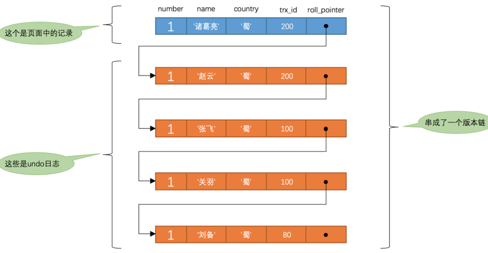

# 介绍多版本并发控制

多版本并发控制技术（Multiversion Concurrency Control，MVCC）

技术是为了解决问题而生的，通过 MVCC 我们可以解决以下几个问题：

1. 读写之间阻塞的问题：通过 MVCC 可以让读写互相不阻塞，即读不阻塞写，写不阻塞读，这样就可以提升事务并发处理能力。
2. 降低了死锁的概率：这是因为 MVCC 没有使用锁，读取数据时并不需要加锁，对于写操作，也只锁定必要的行。
3. 解决一致性读的问题：一致性读也被称为快照读，当我们查询数据库在某个时间点的快照时，只能看到这个时间点之前事务提交更新的结果，而不能看到这个时间点之后事务提交更新的结果。

# MVCC 的思想

MVCC 是通过数据行的历史版本来实现数据库的并发控制。

简单来说 MVCC 的思想就是保存数据的历史版本。这样一个事务进行查询操作时，就可以通过比较版本号来判断哪个较新的版本对当前事务可见。

# InnoDB 对 MVCC 的实现

MVCC 没有正式的标准，所以在不同的 DBMS 中，MVCC 的实现方式可能是不同的。

InnoDB 对 MVCC 的实现主要是通过 版本链 + ReadView 结构完成。

## 版本链存储记录的多个版本

> 先介绍聚簇索引记录的隐藏列，再介绍 Undo Log 版本链

------

对于使用 InnoDB 存储引擎的表来说，它的聚簇索引记录中都包含 3 个隐藏列

1. db_row_id：隐藏的行 ID。在没有自定义主键也没有 Unique 键的情况下，会使用该隐藏列作为主键。
2. db_trx_id：操作这个数据的事务 ID，也就是最后一个对该数据进行插入或更新的事务 ID。
3. db_roll_ptr：回滚指针，也就是指向这个记录的 Undo Log 信息。Undo Log 中存储了回滚需要的数据。

> 事务ID
>
> 事务执行过程中，只有在第一次真正修改记录时（比如进行 insert、delete、update 操作），才会被分配一个唯一的、单调递增的事务 ID，如果没有修改记录操作，按照一定的策略分配一个比较大的事务 ID，减少分配事务 ID 的锁竞争。每当事务向数据库写入新内容时， 所写的数据都会被标记操作所属的事务的事务ID。

------

在 InnoDB 存储引擎中，版本链由数据行的 Undo Log 组成。

每次对数据行进行修改，都会将旧值记录到 Undo Log，算是该数据行的一个旧版本。

Undo Log 有两个重要的属性：db_roll_ptr、db_trx_id

- Undo Log 也有一个 db_roll_ptr 属性（insert 操作对应的 Undo Log 没有  db_roll_ptr 属性，因为 insert 操作对应的数据行没有更早的版本），Undo Log 的 db_roll_ptr 属性指向上一次操作的 Undo Log，所有的版本被 db_roll_ptr 属性连接形成一个链表。该链表即版本链，版本链的头节点就是数据行的最新值。

- Undo Log 还包含生成该版本时，对应的事务 ID，用于判断当前版本的数据对事务的可见性。

版本链如下图所示。这样如果我们想要查找历史快照，就可以通过遍历回滚指针的方式进行查找。

## ReadView 判断版本链中的哪个较新的版本对当前事务是可见的

ReadView 用来判断版本链中的哪个较新的版本对当前事务是可见的。

ReadView 中主要包含 4 个比较重要的属性：

- m_ids：表示在生成 ReadView 时，当前系统中所有活跃的读写事务的 ID 集合（列表）
- min_transaction_id：表示在生成 ReadView 时，m_ids 中的最小值
- max_transaction_id：表示在生成 ReadView 时，系统应该分配给下一个事务的 ID 值
- creator_transaction_id：表示生成该 ReadView 的事务的 ID

------

有了这个 ReadView，这样在访问某条记录时，就可以用 ReadView 来判断版本链中的哪个较新的版本对当前事务是可见的。

- 如果被访问版本的 transaction_id 属性值与 ReadView 中的 creator_trx_id 值相同，表明当前事务在访问它自己修改过的记录，所以该版本可以被当前事务访问。
- 如果被访问版本的 transaction_id 属性值 小于 ReadView 中的 min_trx_id 值，表明生成该版本的事务在当前事务生成 ReadView 前已经提交了，所以该版本可以被当前事务访问。
- 如果被访问版本的 transaction_id 属性值 大于 ReadView 中的 max_trx_id 值，表明生成该版本的事务在当前事务生成 ReadView 后才开启，所以该版本不可以被当前事务访问。
- 如果被访问版本的 transaction_id 属性值在 ReadView 的 min_trx_id 和 max_trx_id 之间，那就需要判断一下 transaction_id 属性值是不是在 m_ids 列表中：

- - 如果在，表明生成 ReadView 时，被访问版本的事务还是活跃的，所以该版本不可以被当前事务访问
  - 如果不在，表明生成 ReadView 时，被访问版本的事务已经被提交了，所以该版本可以被当前事务访问 

如果某个版本的数据对当前事务不可见的话，那就顺着版本链找到下一个版本的数据，继续按照上边的步骤判断

可见性，依此类推，直到版本链中的最后一个版本。如果最后一个版本也不可见的话，那么就意味着该条记录对当前事务完全不可见，查询结果就不包含该记录。

## ReadView 的生成时机

MVCC 可以防止脏读，也可以防止不可重复读。

防止脏读 和 防止不可重复读 实现的不同之处就在：ReadView 的生成时机不同

- 防止脏读：每次读取数据前，都生成一个 ReadView
- 防止不可重复读：在当前事务第一次读取数据时，生成一个 ReadView，之后的查询操作都重复使用这个 ReadView

------

对于隔离级别为 读未提交 的事务来说，直接读取记录的最新版本即可。

对于隔离级别为 串行化 的事务来说，InnoDB 存储引擎使用加锁的方式来访问记录。

对于隔离级别为 读已提交 和 可重复读 的事务来说，都必须保证只能读到已经提交的事务修改的数据，不能读到未提交的事务修改的数据。

# 参考资料

[MySQL 是怎样运行的：从根儿上理解 MySQL - 小孩子4919 - 掘金课程 (juejin.cn)](https://juejin.cn/book/6844733769996304392/section/6844733770071801870)