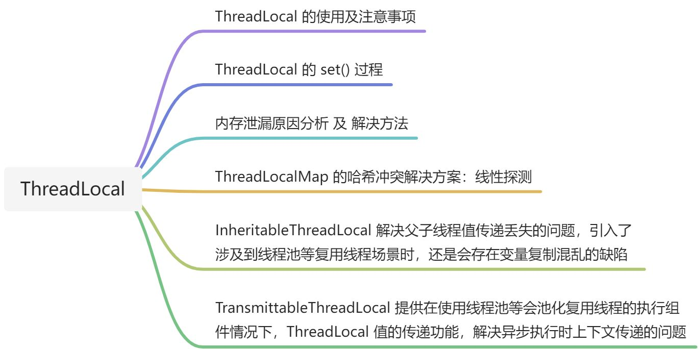
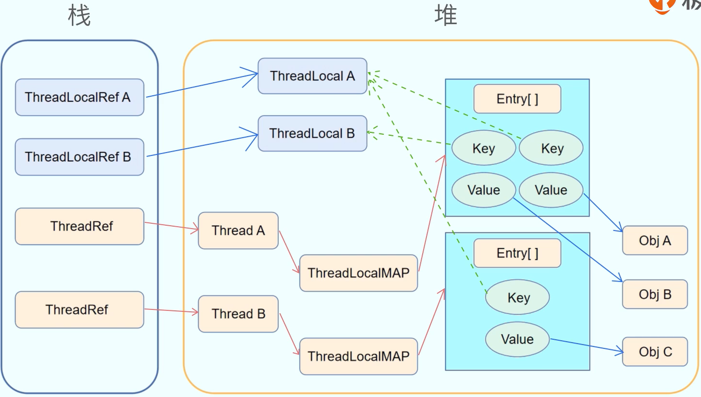
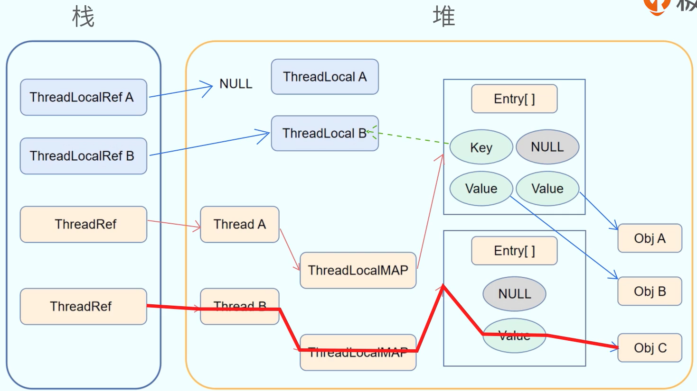
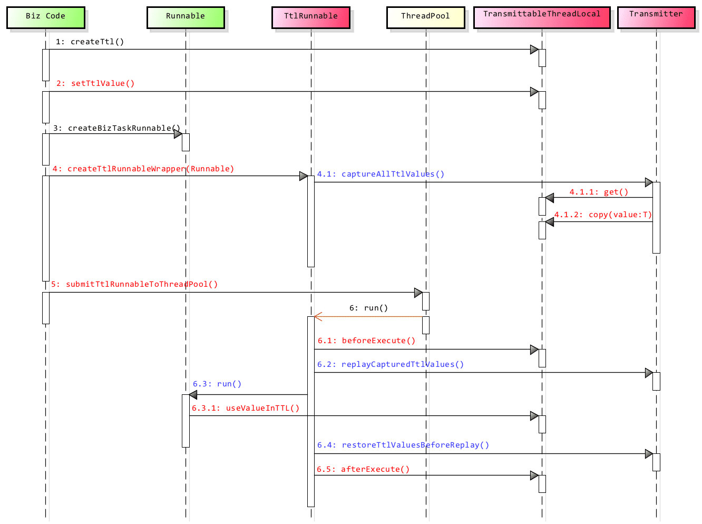

[线程本地存储 · 语雀 (yuque.com)](https://www.yuque.com/haofeiyu/java/oz8uve)

线程本地存储提供了线程内存储变量的能力，这些变量是线程私有的。

线程本地存储一般用在跨类、跨方法的传递一些值。

线程本地存储也是解决特定场景下线程安全问题的思路之一（每个线程都访问本线程自己的变量）。

Java 语言提供了线程本地存储，ThreadLocal 类。



# ThreadLocal 的使用及注意事项

```java
public class TestClass {
    public static ThreadLocal<Integer> threadLocal = new ThreadLocal<>();

    public static void main(String[] args) {
        // 设置值
        threadLocal.set(1);
        test();
    }

    private static void test() {
        // 获取值,返回 1
        threadLocal.get();
        // 防止内存泄漏
        threadLocal.remove();
    }
}
```

static 修饰的变量是在类在加载时就分配地址了，在类卸载才会被回收，因此使用 static 的 ThreadLocal，延长了 ThreadLocal 的生命周期，可能会导致内存泄漏。

分配使用了 ThreadLocal，又不调用 get()、set()、remove() 方法，并且当前线程迟迟不结束的话，那么就会导致内存泄漏。

# ThreadLocal 的 set() 过程



每一个 Thread 实例对象中，都会有一个 ThreadLocalMap 实例对象；

ThreadLocalMap 是一个 Map 类型，底层数据结构是 Entry 数组；

一个 Entry 对象中又包含一个 key 和 一个 value 

- key 是 ThreadLocal 实例对象的弱引用
- value 就是通过 ThreadLocal#set() 方法实际存储的值

```java
static class Entry extends WeakReference<ThreadLocal<?>> {
    /**
     * The value associated with this ThreadLocal.
     */
    Object value;

    Entry(ThreadLocal<?> k, Object v) {
        super(k);
        value = v;
    }
}
```

------

下面我们通过源码分析 ThreadLocal#set() 的过程。

- 获取当前线程
- 获取当前线程的 ThreadLocalMap
- 将存储的值设置到 ThreadLocalMap

```java
public void set(T value) {
    // 获取当前线程
    Thread t = Thread.currentThread();
    // 获取当前线程的 ThreadLocalMap
    ThreadLocal.ThreadLocalMap map = getMap(t);
    if (map != null) {
        // 将存储的值设置到 ThreadLocalMap
        map.set(this, value);
    } else {
        // 首次设置存储的值，需要创建 ThreadLocalMap
        createMap(t, value);
    }
}
```

# ThreadLocalMap 的内存泄露

## 介绍内存泄漏

内存泄漏（Memory leak） 

本质上，内存泄漏可以定义为：当进程不再需要某些内存的时候，这些不再被需要的内存依然没有被进程回收。

造成内存泄漏的原因：不再需要（没有作用）的实例对象依然存在着强引用关系，无法被垃圾收集器回收

## 内存泄露的原因分析

ThreadLocalMap 是一个 Map 类型，底层数据结构是 Entry 数组；

一个 Entry 对象的 key 是 ThreadLocal 实例对象的弱引用。

一个对象如果只剩下弱引用，则该对象在垃圾收集时就会被回收

ThreadLocalMap 使用 ThreadLocal 实例对象的弱引用作为 key 时，如果一个 ThreadLocal 实例对象没有强引用引用它，比如手动将 ThreadLocal A 这个对象赋值为 null，那么系统垃圾收集时，这个 ThreadLocal A 势必会被回收，这样一来 ThreadLocalMap 中就出现了 key 为 null 的 Entry，Java 程序没有办法访问这些 key 为 null 的 Entry，故没有办法删除 Entry 对 value 的强引用，则这个 value 无法被回收，直到线程的生命周期结束。

- 如果当前线程迟迟不结束的话（比如使用了线程池，或者当前线程还在执行其他耗时的任务）那么这些 key 为 null 的 Entry 的 value 就会一直存在一条强引用链，导致 value 无法被回收。
- 只有当前线程结束以后，ThreadRef 就不存在于栈中了，强引用断开，Thread 对象、ThreadLocalMap 对象、Entry 数组、Entry 对象、value 依次回收。


造成内存泄漏的原因是：由于 ThreadLocalMap 的生命周期跟 Thread 一样长，当 Thread 的生命周期过长时，导致 value 无法回收，而不是因为弱引用。

- Entry 对象的 key 是 ThreadLocal 实例对象的弱引用，造成 value 无法被回收。实际是 ThreadLocalMap 的设计中，已经考虑到了这种情况，也加上了一些防护措施，我们在下面内存泄漏的解决办法中介绍。
- 如果 Entry 对象的 key 是 ThreadLocal 实例对象的强引用的话，那么会造成 key 和 value 都无法被回收。

------

强引用链如下图红线所示：

强引用链的表述如下：

ThreadRef 引用 Thread，Thread 引用 ThreadLocalMap，ThreadLocalMap 引用 Entry，Entry 引用 value



## 内存泄露的解决办法

Entry 对象的 key 是 ThreadLocal 实例对象的弱引用，造成 value 无法被回收。

实际是 ThreadLocalMap 的设计中，已经考虑到了这种情况，也加上了一些防护措施。

在调用 ThreadLocal 的 get()、set() 方法操作数据，从指定位置开始遍历 Entry 时，会找到 Entry 不为 null，但 key 为 null 的 Entry，并删除 key 为 null 的 Entry 的 value 和对应的 Entry。

------

但是，如果 ThreadLocal 实例对象的强引用被删除后，线程长时间存活，又没有再对该线程的 ThreadLocalMap 实例对象进行操作，也就是没有再调用 get()、set() 方法，那么依然会存在内存泄漏。

所以，避免内存泄漏最好的做法是：主动调用 ThreadLocal 对象的 remove() 方法，将设置的线程本地变量的值删除。

```java
/**
 * Remove the entry for key.
 */
private void remove(ThreadLocal<?> key) {
    ThreadLocal.ThreadLocalMap.Entry[] tab = table;
    int len = tab.length;
    int i = key.threadLocalHashCode & (len-1);
    for (ThreadLocal.ThreadLocalMap.Entry e = tab[i];
         e != null;
         e = tab[i = nextIndex(i, len)]) {
        if (e.get() == key) {
            e.clear();
            expungeStaleEntry(i);
            return;
        }
    }
}
```

------

get()、set()、remove() 实际都会调用 ThreadLocalMap#expungeStaleEntry() 方法来进行删除 Entry，下面我们来看一下代码实现。

```java
// 入参 staleSlot 是当前被删除对象在 Entry 数组中的位置
private int expungeStaleEntry(int staleSlot) {
    ThreadLocal.ThreadLocalMap.Entry[] tab = table;
    int len = tab.length;

    // 删除 staleSlot 位置的 value，key 已经在进入该方法前删除了 / 已经被回收
    // expunge entry at staleSlot
    tab[staleSlot].value = null;
    // 将 Entry 对象赋值为 null，断开 Entry 实例对象的强引用
    tab[staleSlot] = null;
    // Entry 数组大小 - 1
    size--;

    // Rehash until we encounter null
    ThreadLocal.ThreadLocalMap.Entry e;
    int i;
    // for 循环的作用是从当前位置开始向后循环处理 Entry 中的 ThreadLocal 对象
    // 将从指定位置开始，遇到 null 之前的所有 ThreadLocal 对象 rehash
    for (i = nextIndex(staleSlot, len); (e = tab[i]) != null; i = nextIndex(i, len)) {
        // 获取 ThreadLocal 的虚引用引用的实例对象
        ThreadLocal<?> k = e.get();
        if (k == null) {
            // 虚引用引用的实例对象为 null，说明 ThreadLocal 已经被回收了
            // 则删除 value 和 Entry，让虚拟机能够回收
            e.value = null;
            tab[i] = null;
            size--;
        } else {
            // rehash
            int h = k.threadLocalHashCode & (len - 1);
            if (h != i) {
                tab[i] = null;
                // 从当前 h 的位置向后找，找到一个 null 的位置将 e 填入
                // Unlike Knuth 6.4 Algorithm R, we must scan until
                // null because multiple entries could have been stale.
                while (tab[h] != null) {
                    h = nextIndex(h, len);
                }

                tab[h] = e;
            }
        }
    }
    return i;
}
```

# ThreadLocalMap 的哈希冲突

ThreadLocalMap 里处理 hash 冲突的机制不是像 HashMap 一样使用链表（拉链法）。

它采用的是另一种经典的处理方式，沿着冲突的索引向后查找空闲的位置（开放寻址法中的线性探测法）。

下面我们通过 ThreadLocal 的 set()、get() 方法源码，分析 ThreadLocalMap 的哈希冲突解决方案。

```java
// set() 的关键方法,被 set(Object value) 调用
private void set(ThreadLocal<?> key, Object value) {

    // We don't use a fast path as with get() because it is at
    // least as common to use set() to create new entries as
    // it is to replace existing ones, in which case, a fast
    // path would fail more often than not.

    ThreadLocal.ThreadLocalMap.Entry[] tab = table;
    int len = tab.length;
    // 计算 key 在数组中的下标，其实就是 ThreadLocal 的 hashCode 和 数组大小-1 取余
    int i = key.threadLocalHashCode & (len - 1);

    // 整体策略：查看 i 索引位置有没有值，有值的话，索引位置 + 1，直到找到没有值的位置
    // 这种解决 hash 冲突的策略，也导致了其在 get 时查找策略有所不同，体现在 getEntryAfterMis
    // nextIndex() 就是让在不超过数组长度的基础上，把数组的索引位置 + 1
    for (ThreadLocal.ThreadLocalMap.Entry e = tab[i]; e != null; e = tab[i = nextIndex(i, len)]) {
        ThreadLocal<?> k = e.get();

        // 找到内存地址一样的 ThreadLocal，直接替换
        // 即，修改线程本地变量
        if (k == key) {
            e.value = value;
            return;
        }

        // 当前 key 是 null，说明 ThreadLocal 被清理了，直接替换掉并返回
        if (k == null) {
            replaceStaleEntry(key, value, i);
            return;
        }
    }

    // 当前 i 位置是无值的，可以被当前 thradLocal 使用
    tab[i] = new ThreadLocal.ThreadLocalMap.Entry(key, value);
    int sz = ++size;
    // 当数组大小大于等于扩容阈值（数组大小的三分之二）时，进行扩容
    if (!cleanSomeSlots(i, sz) && sz >= threshold) {
        rehash();
    }
}
```

上面源码我们注意几点：

1. 是通过递增的 AtomicInteger 作为 ThreadLocal 的 hashCode 的；
2. 计算数组索引位置的公式是：hashCode 取模 数组大小-1，由于 hashCode 不断自增，所以不同的 hashCode 大概率上会计算到同一个数组的索引位置（但这个不用担心，在实际项目中，ThreadLocal 都很少，基本上不会冲突）；
3. 通过 hashCode 计算的索引位置 i 处如果已经有值了，会从 i 开始，通过 +1 不断的往后寻找，直到找到索引位置为空的地方，把当前 ThreadLocal 作为 key 放进去。

------

```java
// get 的关键方法,被 get() 方法调用

// 得到当前 thradLocal 对应的值，值的类型是由 thradLocal 的泛型决定的
// 首先尝试根据 hashcode 取模 数组大小-1 = 索引位置 i 寻找，找不到的话，自旋把 i+1，直到找到
private ThreadLocal.ThreadLocalMap.Entry getEntry(ThreadLocal<?> key) {
    int i = key.threadLocalHashCode & (table.length - 1);
    ThreadLocal.ThreadLocalMap.Entry e = table[i];
    // e 不为空，并且 e 的 ThreadLocal 的内存地址和 key 相同，直接返回，否则就是没有找到，继续寻找
    if (e != null && e.get() == key) {
        return e;
    } else {
        // 这个取数据的逻辑，是因为 set 时数组索引位置冲突造成的
        return getEntryAfterMiss(key, i, e);
    }
}

// 自旋 i+1，直到找到为止
private ThreadLocal.ThreadLocalMap.Entry getEntryAfterMiss(ThreadLocal<?> key, int i, ThreadLocal.ThreadLocalMap.Entry e) {
    ThreadLocal.ThreadLocalMap.Entry[] tab = table;
    int len = tab.length;

    while (e != null) {
        ThreadLocal<?> k = e.get();
        // 内存地址一样，表示找到了
        if (k == key) {
            return e;
        }
        // 删除不再使用的 Entry，避免内存泄漏
        if (k == null) {
            expungeStaleEntry(i);
        } else {
            // 继续使索引位置 + 1
            i = nextIndex(i, len);
        }
        e = tab[i];
    }
    return null;
}
```

# ThreadLocalMap 的扩容策略

```java
// set() 的部分源码
if (!cleanSomeSlots(i, sz) && sz >= threshold){
    rehash();
}

// 称为启发式清理，从指定下标开始遍历
private boolean cleanSomeSlots(int i, int n) {
    boolean removed = false;
    ThreadLocal.ThreadLocalMap.Entry[] tab = table;
    int len = tab.length;
    do {
        i = nextIndex(i, len);
        ThreadLocal.ThreadLocalMap.Entry e = tab[i];
        if (e != null && e.get() == null) {
            n = len;
            removed = true;
            i = expungeStaleEntry(i);
        }
    } while ( (n >>>= 1) != 0);
    return removed;
}

private void rehash() {
    // 探测式清理，从数组的下标为 0 处开始遍历，清理所有无用的 Entry
    expungeStaleEntries();

    // 扩容使用较低的阈值，以避免迟滞
    // Use lower threshold for doubling to avoid hysteresis
    if (size >= threshold - threshold / 4)
        resize();
}
```


由上面源码我们可以看出，ThreadLocalMap 扩容的时机是，ThreadLocalMap 中的 ThreadLocal 的个数超过阈值，并且 cleanSomeSlots() 返回 false（启发式清理），然后尝试清理所有 key 为 null 的 Entry，清理完之后 ThreadLocal 的个数仍然大于阈值的四分之三，ThreadLocalMap 就要开始扩容了， 我们一起来看下扩容的逻辑：

```java
// 扩容
private void resize() {
    // 拿出旧的数组
    ThreadLocal.ThreadLocalMap.Entry[] oldTab = table;
    int oldLen = oldTab.length;
    // 新数组的大小为老数组的两倍
    int newLen = oldLen * 2;
    // 初始化新数组
    ThreadLocal.ThreadLocalMap.Entry[] newTab = new ThreadLocal.ThreadLocalMap.Entry[newLen];
    int count = 0;
    // 老数组的值拷贝到新数组上
    for (int j = 0; j < oldLen; ++j) {
        ThreadLocal.ThreadLocalMap.Entry e = oldTab[j];
        if (e != null) {
            ThreadLocal<?> k = e.get();
            if (k == null) {
                e.value = null; // Help the GC
            } else {
                // 计算 ThreadLocal 在新数组中的位置
                int h = k.threadLocalHashCode & (newLen - 1);
                // 如果索引 h 的位置值不为空，往后+1，直到找到值为空的索引位置
                while (newTab[h] != null)
                    h = nextIndex(h, newLen);
                // 给新数组赋值
                newTab[h] = e;
                count++;
            }
        }
    }
    // 给新数组初始化下次扩容阈值，为数组长度的三分之二
    setThreshold(newLen);
    size = count;
    table = newTab;
}
```

源码注解也比较清晰，我们注意两点：

1. 扩容后数组大小是原来数组的两倍，下一次的扩容阈值为数组长度的三分之二；
2. 扩容时是没有线程安全问题的，因为 ThreadLocalMap 是线程的一个属性，一个线程同一时刻只能对 ThreadLocalMap 进行操作，因为同一个线程执行业务逻辑必然是串行的，那么操作 ThreadLocalMap 必然也是串行的。

------

ThreadLocalMap 扩容策略的语言描述：

在 ThreadLocalMap.set() 方法的最后，如果执行完启发式清理工作后，未清理到任何 Entry，且当前数组中 Entry 的数量已经达到了扩容阈值（数组长度的三分之二），就开始执行 rehash() 逻辑。

rehash() 首先是会进行探测式清理工作，从数组的起始位置开始遍历，查找 key 为 null 的 Entry 并清理。清理完成之后如果 ThreadLocal 的个数仍然大于等于扩容阈值的四分之三，那么就进行扩容操作，扩容为原来数组长度的两倍，并且设置下一次的扩容阈值为新数组长度的三分之二。

# InheritableThreadLocal 与继承性

通过 ThreadLocal 创建的线程变量，其子线程是无法继承的。

也就是说你在线程中通过 ThreadLocal 创建了线程变量 V，而后该线程创建了子线程，你在子线程中是无法通过 ThreadLocal 来访问父线程的线程变量 V 的。

```java
public class TestClass {
    public static ThreadLocal<Integer> threadLocal = new ThreadLocal<>();

    public static void main(String[] args) {
        threadLocal.set(1);
        // 返回 1
        threadLocal.get();

        new Thread(new Runnable() {
            @Override
            public void run() {
                // 返回 null
                threadLocal.get();
            }
        }).start();
    }
}
```

------

如果你需要子线程继承父线程的线程变量，那该怎么办呢？

JDK 的 InheritableThreadLocal 类可以完成父线程到子线程的值传递。

InheritableThreadLocal 是 ThreadLocal 子类，所以用法和 ThreadLocal 相同。

使用时，改为 `ThreadLocal<Integer> threadLocal = new InheritableThreadLocal<>();` 即可。

InheritableThreadLocal 在创建子线程的时候（初始化线程时），在 Thread#init() 方法中拷贝父线程中本地变量的值到子线程的本地变量中，子线程就拥有了和父线程一样的本地变量。

下面是 Thread#init() 中，和 ThreadLocal 相关的代码，我们一起来看下这个功能是怎么实现的

```java
public class Thread implements Runnable {
    // 如果是使用 ThreadLocal 进行 set()，则使用该变量保存
    ThreadLocal.ThreadLocalMap threadLocals = null;
    // 如果是使用 InheritableThreadLocal 进行 set()，则使用该变量保存
    ThreadLocal.ThreadLocalMap inheritableThreadLocals = null;

    private void init(ThreadGroup g, Runnable target, String name, long stackSize, AccessControlContext acc) {
        // ...
        Thread parent = currentThread();
        // ...
        if (parent.inheritableThreadLocals != null) {
            // 根据 parent.inheritableThreadLocals 重新 new 一个 ThreadLocalMap 对象
            this.inheritableThreadLocals = ThreadLocal.createInheritedMap(parent.inheritableThreadLocals);
        }
        // ...
    }
}
```

------

不过，完全不建议你在线程池中使用 InheritableThreadLocal，不仅仅是因为它具有 ThreadLocal 相同的缺点：可能导致内存泄露，更重要的原因是：线程池中线程的创建是动态的，很容易导致继承关系错乱，如果你的业务逻辑依赖 InheritableThreadLocal，那么很可能导致业务逻辑计算错误，而这个错误往往比内存泄露更要命。

同时，如果父线程的本地变量是引用数据类型的话，父子线程共享相同的数据，存在线程安全问题，甚至导致业务逻辑计算错误。要想做到父子线程的本地变量互不影响，则需要继承 InheritableThreadLocal 并重写 childValue() 方法实现对象的深拷贝 。

并且对于使用线程池等会池化复用线程的执行组件的情况，线程由线程池创建好，并且线程是池化起来反复使用的；这时父子线程关系的 ThreadLocal 值传递已经没有意义，应用需要的实际上是把任务提交给线程池时的ThreadLocal 值传递到任务执行时。阿里开源的 TransmittableThreadLocal 类继承并加强 InheritableThreadLocal 类，解决上述的问题。

# TransmittableThreadLocal

TransmittableThreadLocal 的 GitHub：https://github.com/alibaba/transmittable-thread-local

TransmittableThreadLocal 的 API 文档：https://alibaba.github.io/transmittable-thread-local

TransmittableThreadLocal 是阿里开源的一个增强 InheritableThreadLocal 的库。

TransmittableThreadLocal 的功能：在使用线程池等会池化复用线程的执行组件情况下，提供 ThreadLocal 值的传递功能，解决异步执行时上下文传递的问题。

## TTL 的使用及注意事项

TTL 的 User Guide：https://github.com/alibaba/transmittable-thread-local#-user-guide

TransmittableThreadLocal 有三种使用方式（具体使用见 GitHub 的 [README](https://github.com/alibaba/transmittable-thread-local#readme)）：

- 修饰 Runnable 或 Callable
- 修饰线程池
- 使用 Java Agent 来修饰 JDK 线程池实现类

> 注意事项：
>
> 使用 TtlRunnable 和 TtlCallable 来修饰传入线程池的 Runnable 和 Callable 时，即使是同一个 Runnable 任务多次提交到线程池时，每次提交时都需要通过修饰操作（即TtlRunnable.get(task)）以抓取这次提交时的 TransmittableThreadLocal 上下文的值；即如果同一个任务下一次提交时不执行修饰而仍然使用上一次的 TtlRunnable，则提交的任务运行时会是之前修饰操作所抓取的上下文。
>
> 修饰线程池其实本质上也是修饰 Runnable，只是将这个逻辑移到了 ExecutorServiceTtlWrapper.submit() 方法内，对所有提交的 Runnable 进行修饰。

------

```java
public class Main {
    static int val = 0;

    public static void main(String[] args) {
        TransmittableThreadLocal<String> ttl = new TransmittableThreadLocal();

        ExecutorService executorService = Executors.newFixedThreadPool(1);
        Runnable task = new Runnable() {
            @Override
            public void run() {
                System.out.println("child thread get " + ttl.get());
            }
        };
        for (int i = 0; i < 5; i++) {
            val++;
            ttl.set("value-set-in-parent " + val);
            executorService.execute(TtlRunnable.get(task));
        }
        executorService.shutdown();
    }
}
```

## TTL 的原理



TTL 做的是，使用装饰器模式装饰 Runnable 等任务，将原本与 Thread 绑定的线程变量，缓存一份到 TtlRunnable 对象中，每次调用任务的 run() 前后进行 set() 和还原数据。


## TTL 的需求场景

[需求场景说明](https://github.com/alibaba/transmittable-thread-local/blob/master/docs/requirement-scenario.md)

# 总结

使用 ThreadLocal 库友好地解决了线程本地存储的问题，但是它还存在父子线程值传递丢失的问题，于是 JDK 又引入了 InheritableThreadLocal 对象。

InheritableThreadLocal 的出现又引出了下一个问题，那就是涉及到线程池等复用线程场景时，还是会存在变量复制混乱的缺陷。阿里巴巴提供了解决方案，用 TransmittableThreadLocal  来增强 InheritableThreadLocal 对象。

# 参考资料

[30 | 线程本地存储模式：没有共享，就没有伤害-极客时间 (geekbang.org)](https://time.geekbang.org/column/article/93745)

[ThreadLocal原理分析及内存泄漏演示-极客时间 (geekbang.org)](https://time.geekbang.org/dailylesson/detail/100056807?tid=147)

[ThreadLocal如何在父子线程及线程池中传递？-极客时间 (geekbang.org)](https://time.geekbang.org/dailylesson/detail/100056808?tid=147)

https://github.com/alibaba/transmittable-thread-local
